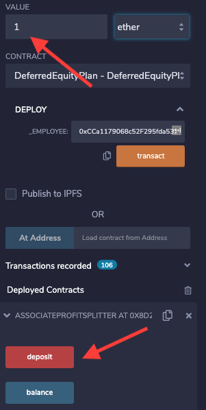

# HOMEWORK 20 SOLIDITY: EMPLOYEE INCENTIVES
# Contract I: Associate Profit Splitter
**Goal** This contract seeks to split contract input value evenly across 3 employees. 

**Code** First the contract defines the 3 employee variables and the constructor function. Then follow 3 main functions. The `deposit` function takes the deployment `value` and sends this evenly divided to the 3 employees. Any remaining value is returned to sender. The `balance` function returns the current contract balance, this should always be zero. Finally the `external payable` function is the fallback function for any ether sent directly to the contract which is automatically distributed to the 3 employees.

**How it works** Connect Metamask to Ropsten Testnet and verify Solidity Ropsten Testnet connection.
   
 
 
    
After successful compilation, deploy the contract on Ropsten Testnet by providing the 3 employee addresses and click `transact`. The owner's address will be charged gas fees.
 
 
 
 
 
After successful deployment, the user can interact with the contract functions and variables. Eg deposit ether into the contract via the deployment Value field followed by clicking `deposit`.
 
 
 
 
 
**ROPSTEN TESTNET CONTRACT ADDRESS** 0x8D2ee91f642DBa19E04A10Af491e8197DaB1778E

# Contract II: Tiered Profit Splitter
**Goal** This contract split contract input value to 3 employees proportional to their position (eg CEO 60%, CTO 25%, employee 15%).

**Code** First the contract defines the 3 employee variables and the constructor function. Then follow 3 main functions. The `deposit` function takes the deployment `value` and sends this proportionally to the 3 employees. Any remaining value is sent to the CEO. The `balance` function returns the current contract balance, this should always be zero. Finally the `external payable` function is the fallback function for any ether sent directly to the contract which is automatically distributed to the 3 employees.

**How it works** Please see steps above. 

**ROPSTEN TESTNET CONTRACT ADDRESS** 0x35BA2445dd27bB16f169Dd1998c0c8C184C5C17C
 
 
# Contract III: Deferred Equity Plan Splitter

**Goal** This contract implements an employee equity incentive plan where the equity award of 1,000 units vests evenly over 4 years. The contract offers the ability to test the vesting feature.

**Code** The contract assumes that it is deployed by human resources. It defines the time variables `fakenow`, `start_time` and `unlock_time` for the vesting schedule, as well as the employee address. The contract also sets the award at 1,000 units in 4 annual installments and a `distributed_shares` tracker. The constructor function initializes the employee and human resource addresses, followed by the 4 main functions. The `distribute` function first verifies the contract deployer as either human resources or the employee and the contract status. It also checks the vesting status and if the distributed shares cap has been reached. If all requirements have been met, the next vesting date is moved forward by 1 year and the distributed shares tracker is updated. 

The function `deactivate` allows human resources or the employee to deactivate the contract. 

The function `fast forward` allows the user to test the vesting functionality.

Finally the `external payable` function is the fallback function for any ether sent directly to the contract which is reverted to sender.

**How it works** This contract does not require a deposit as the equity award is defined inside the contract. To deploy, simply provide the employee address and then interact with the contract functions and public variables.

**ROPSTEN TESTNET CONTRACT ADDRESS** 0x76ebF05Feb00b8cfb6b27b8973E1aBff30D0DfEa
