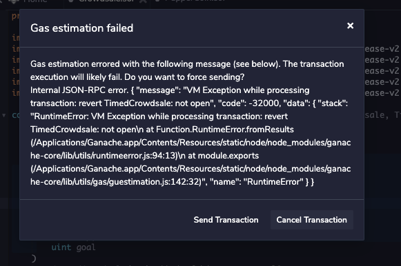
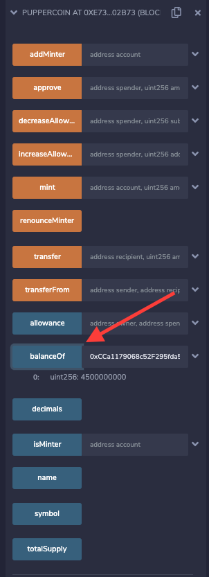

# UNIT 21 ADVANCED SOLIDITY ASSIGNMENT

## Summary
We have implemented a crowdsale campaign for the CARA token, an ERC20 token. CARA tokens are purchased using ETH with an exchange rate of 1. The campaign runs for a 24-week period, has a 4bn funding target and a 5bn funding cap. Purchase amounts are held in escrow until the sale ends when tokens are distributed. Sales are refundable; if the campaign fails to hit its target, purchases can be refunded. 

## The Code

The Solidity code includes 3 contracts: 
1) PupperCoin.sol: mints an ERC20 token with the parameters name, symbol and initial supply.

2) PupperCoinCrowdSale: deploys the CrowdSale using the OpenZeppelin libraries Crowdsale, MintedCrowdsale, CappedCrowdsale, TimedCrowdsale, and RefundablePostDeliveryCrowdsale

3) PupperCoinCrowdSaleDeployer: implements dual deployment of the PupperCoin.sol and PupperCoinCrowdSale.sol contracts passing all relevent parameters. This contract also hardcodes the campaign time window

The last 2 contracts are included in the CrowdSale.sol file.

## How it works
1) open Remix and compile and deploy the 2 contract files: PupperCoin.sol and PupperCoinCrowdSale.sol

2) deploy the PupperCoinCrowdSaleDeployer by providing the token parameters: name, symbol, wallet (for proceeds), fundraising goal & cap

Click confirm on the Metamask pop-up. 

3) Following deployment, open the deployed PupperCoinCrowdSaleDeployer contract and click on the token_address and token_sale_address:

Deploy each address using the At Address box while selecting the right contract to deploy.

 ''

4) To buy CARA token, open PupperCoinCrowdSale, enter recipient wallet address and the value in the VALUE field above, then click buyTokens. Confirm on Metamask

5) You can purchase tokens until the sale ends (time window has been preset to 24 weeks) after which the following error message appears:

Once sale has expired, you need to manually finalize the campaign in order to enable token withdrawal. Under the PupperCoinCrowdSale contract, click Finalize and confirm on MetaMask.

6) Purchases above the cap are not allowed.

7) Once the sale has been finalized and the goal has been met, the purchased tokens can be withdrawn by clicking on Withdraw function or, if the goal has not been met, the purchaser can request a refund by clicking on Refund.

8) in case of token withdrawal the new balance can be seen under the Puppercoin contract or on MetaMask:

To see the token balance on MetaMask, activate the recipient address on MetaMask and click add token and provide the token address. After processing, click on Assets to see the new token's balance.

9) Once you're comfortable deploying the crowdsale on Local, it can be deployed on Ropsten. I incurred the following gas fees:

Contract deployment: 0.024114 ETHD (~USD 62)

Token purchase: 0.000879 ETH (~USD 22)